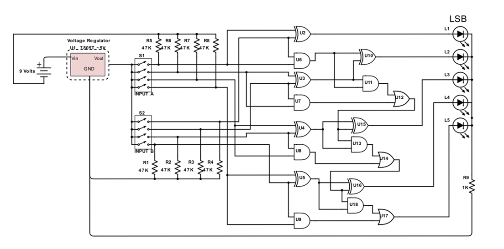
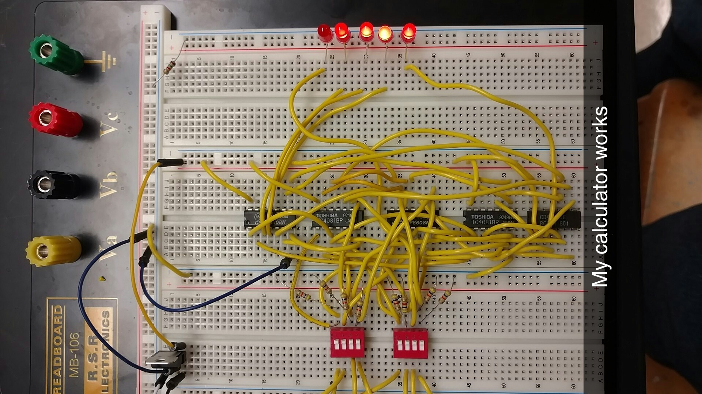
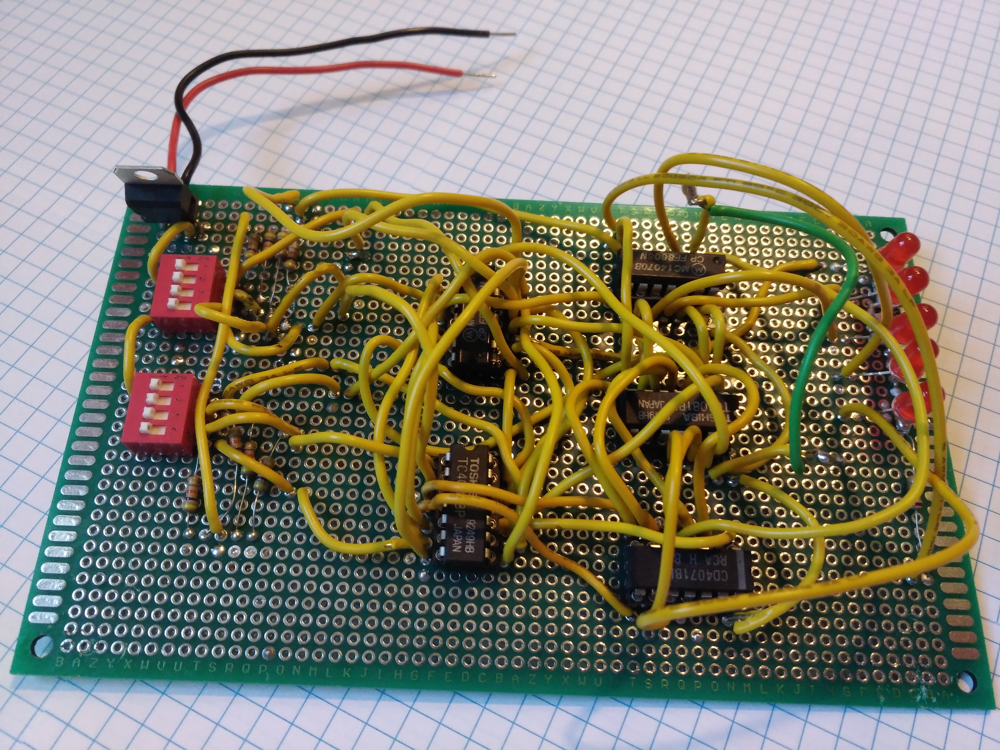

In my high school electronics class, I decided to build a 4bit full adder out of discreet CMOS 40XX series integrated circuits.  
This means there were only AND, OR, and XOR gates in my design.  

The final circuit did work, and taught me important lessons about simulating designs, prototyping, testing, and documenting your work.  

  Link to the full project report here: <a href="../assets/static/AdderProjectReport.pdf" >Schematics, BOM, and project report PDF</a>

## Schematic
The 4 bit full adder was made entirely of CMOS40XX series integrated circuits, using only AND, OR, and XOR gates.  

  

## Prototyping
Prototyping of the circuitry was done on a breadboard with a mess of jumper wires as shown below.  

  

## Finished Product
The 4 bit inputs could be set using the 4-bit DIP switches on the left.  

The sum of the 4 bit inputs was displayed as 5 red LEDs on the right.  

  

  